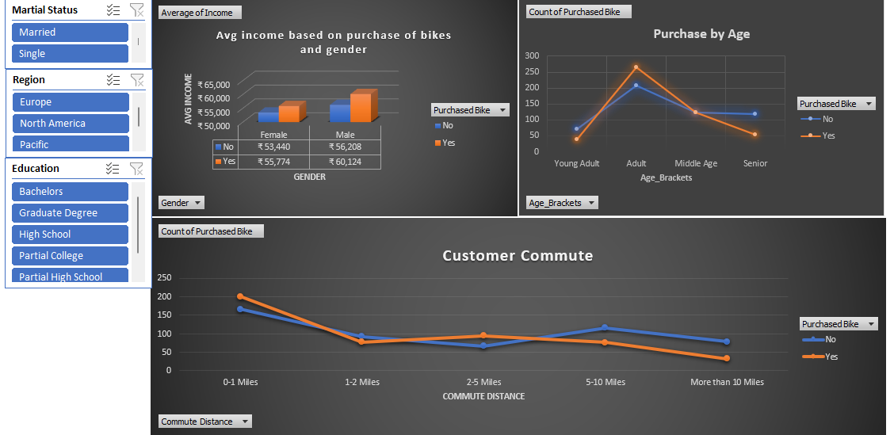

# Excel Bike Sales Dashboard

## Project Overview

This project analyzes customer demographic data to understand the factors influencing bike purchases.
Using Microsoft Excel, the dataset was cleaned, transformed, and analyzed using pivot tables and an interactive dashboard.

The objective of this project is to identify patterns in customer attributes such as age, income, gender, and commute distance that influence bike purchasing behavior.

---

## Dataset

The dataset contains customer demographic information including:

* Age
* Gender
* Marital Status
* Education
* Region
* Income
* Commute Distance
* Bike Purchase Status

---

## Data Preparation

Before performing the analysis, several data cleaning and transformation steps were carried out:

* Standardized categorical values (M/F → Male/Female)
* Standardized marital status values (M/S → Married/Single)
* Created a new **Age Bracket** column to group customers into categories such as Young Adult, Adult, Middle Age, and Senior
* Prepared the data for pivot table analysis

---

## Dashboard Features

The Excel dashboard includes interactive filters (slicers) and visualizations that allow users to explore bike purchasing behavior dynamically.

### Interactive Filters

The dashboard includes slicers for:

* Marital Status
* Region
* Education

These filters allow users to explore the data based on different customer demographics.

---

## Visualizations Included

The dashboard includes the following charts:

1. **Average Income by Gender and Bike Purchase**
2. **Bike Purchase Distribution by Age Group**
3. **Customer Commute Distance vs Bike Purchase**

---

## Key Insights

* Customers with higher average income are more likely to purchase bikes.
* Adult customers show the highest bike purchase rates compared to other age groups.
* Customers with shorter commute distances are more likely to purchase bikes.
* Male customers show slightly higher bike purchase rates compared to female customers.

---

## Tools Used

* Microsoft Excel
* Pivot Tables
* Excel Formulas
* Data Cleaning
* Data Visualization
* Interactive Dashboard (Slicers)

---

## Dashboard Preview

---

## Project Files

* **Bike dataset analysis raw.xlsx** → Original dataset
* **Bike dataset analysis.xlsx** → Cleaned dataset and dashboard
* **dashboard_preview.png** → Dashboard preview image

---

## Conclusion

This project demonstrates how Microsoft Excel can be used for data cleaning, analysis, and dashboard creation to extract meaningful insights from customer data.
